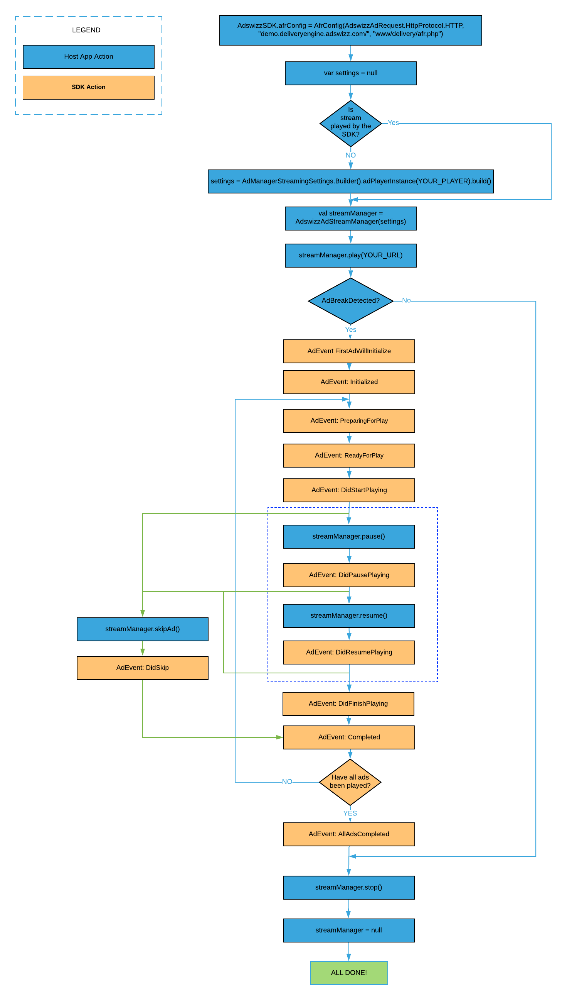

# **AdswizzSDK - Integration guide**
 * [<strong>Before you start</strong>](#before-you-start)
      * [What is ‘Client-Side Insertion’](#what-is-client-side-insertion)
      * [What is ‘Server-Side Insertion’](#what-is-server-side-insertion)
      * [Prerequisites for ‘Client-Side Insertion’](#prerequisites-for-client-side-insertion)
      * [Prerequisites for ‘Server-Side Insertion’](#prerequisites-for-server-side-insertion)
 * [<strong>Get started</strong>](#get-started)
      * [Prerequisites](#prerequisites)
      * [Dependencies](#dependencies)
      * [Permissions](#permissions)
      * [Adding the SDK to your AndroidStudioProject project](#adding-the-sdk-to-your-android-studio-project)
      * [SDK initialization and cleanup](#sdk-initialization-and-cleanup)
 * [<strong>Client-Side Insertion</strong>](#client-side-insertion)
      * [Your first ad request](#your-first-ad-request)
      * [Working with AdManager object](#working-with-admanager-object)
      * [AdManager operations](#admanager-operations)
      * [AdManager Interface](#admanager-interface)
         * [prepare](#prepare)
         * [play](#play)
         * [pause](#pause)
         * [skipAd](#skipad)
         * [reset](#reset)
      * [AdManager life cycle](#admanager-life-cycle)         
 * [<strong>Server-Side Insertion</strong>](#server-side-insertion)
      * [Your first stream manager](#your-first-stream-manager)
      * [AdStreamManager Listener interface](#adstreammanager-listener-interface)
      * [AdStreamManager life cycle](#adstreammanager-life-cycle)      
 * [<strong>Interactive ads</strong>](#interactive-ads)
      * [Shake enabled interactive ads](#shake-enabled-interactive-ads)
      * [Voice enabled interactive ads](#voice-enabled-interactive-ads)
      * [Handling interactive ad events](#handling-interactive-ad-events)
 * [<strong>Companion Banner</strong>](#companion-banner)
      * [Adding an AdCompanionView](#adding-an-adcompanionview)
      * [Setting up](#setting-up)
      * [Companion events](#companion-events)
      * [Extra exposure time](#extra-exposure-time)
 * [<strong>Playing ads using your player</strong>](#playing-ads-using-your-player)
      * [AdPlayer Interface](#adplayer-interface)
 * [<strong>Integrate into Wear OS apps</strong>](#integrate-into-wear-os-apps)
      * [ShakeMe on Wear OS](#shakeme-on-wear-os)
      * [Voice Detector on Wear OS](#voice-detector-on-wear-os)
 * [<strong>AdswizzSDK general settings</strong>](#adswizzsdk-general-settings)
      * [GDPR consent](#gdpr-consent)
      * [CCPA config](#ccpa-config)
      * [AFR config](#afr-config)
      * [Integrator Context](#integrator-context)
      * [Extra exposure time for an AdCompanionView](#extra-exposure-time-for-an-adcompanionview)
 * [<strong>(Optional) Prepare your application for advanced targetability capabilities</strong>](#optional-prepare-your-application-for-advanced-targetability-capabilities)
      * [Privacy implications](#privacy-implications)
 * [<strong>Vast Macros</strong>](#vast-macros)
 * [<strong>Sample projects</strong>](#sample-projects)
      * [BasicSample](#basicsample)
      * [StreamingSample](#streamingsample)

# Before you start

This guide is addressed to the Android developers who want to integrate AdswizzSDK in their apps.
Here is a quick overview. More details will be provided for each scenario in their respective section.

## What is Client-Side Insertion

'Client-Side Insertion' represents the insertion of ads into the audio stream done by the integrator. Your app is responsible for the built-in logic to decide when to start and end an ad break by fetching ads from the ad server and playing them with your apps's audio/video capabilities. The SDK will handle all communication during ad fetching with the ad server while being in charge with the display of companion banner and performing various event reporting (impressions & quartiles).

## What is Server-Side Insertion

‘Server-Side Insertion’ represents the insertion of ads in the audio stream done by the server in real time. It requires AIS as a streaming server. AIS is the acronym for Audio Injector for Servers and is an AdsWizz product that does 'server-side insertion'.

The responsibilities are split between streaming server and SDK as follows:
* Streaming Server:
   * detects ad breaks and inserts audio ads into the audio stream
   * sends metadata information to make possible for the SDK to synchronize companion banner with the audio content and to detect interactive ads
* SDK:
   * decorates audio stream URL to increase targetability of ads
   * detects all events associated with an ad break (start, stop, change of ad)
   * retrieves, displays, synchronizes companion banner with audio content based on metadata information
   * may handle the display area for companion banners outside of an ad break
   * retrieves and processes interactivity information based on metadata

## Prerequisites for ‘Client-Side Insertion’

In order to successfully do the ‘Client-Side Insertion’ you will need to set/provide the following information for your **_AdswizzAdRequest_** object within **_AdRequestConnection_**:
*  adServer = the name of AdServer used to fetch ads from
*  zones = one or more ```AdswizzAdZone``` to identify the zone/zones used to retrieve audio/video ads from
*  companionZones = (optional) identifier of zone to retrieve creatives to be displayed by the companion banner
*  (optional) list of custom site variables used for ads selection (e.g referrer)

The following can be set as general AdswizzSDK parameters:
*  (optional) GDPR consent value
*  (optional) CCPA (U.S. privacy string) consent value
*  (optional) integrator context. This contain information that the integrator should provide and will be used by the SDK (for example for VAST macro expansion)

For the client-side scenario, you may use any streaming server provided by your AdsWizz Integration Manager.

## Prerequisites for ‘Server-Side Insertion’

In order to successfully integrate the ‘Server-Side Insertion’, you will need to set the following information:
* in afrConfig:
   *  server = the name of Adserver used to insert ads from
   *  endpoint = contains the identifier of zone to retrieve creatives to be displayed by the companion banner
* in **_AdswizzAdStreamManager_**:
   *  adStreamURL = URL of audio stream. This is given in the play method.

The following can be set as general AdswizzSDK parameters:
*  (optional) GDPR consent value
*  (optional) CCPA (U.S. privacy string) consent value
*  (optional) integrator context. This contain information that the integrator should provide and will be used by the SDK (for example for VAST macro expansion)


# Get started

AdswizzSDK facilitates the ad lifecycle management, right from your application.
Sensing listeners environment, it crafts the overall ad exercise for superior addressability and augmented interactivity.

On top, in a client-side insertion scenario, it retrieves the ad with its associated assets, and handles the reporting operations.<br>
In a server-side insertion scenario, it takes the pressure off your app by making the interactivity and assets easily available.


## Prerequisites

* AndroidStudio 3.4+
* Gradle build system

## Dependencies

 A list of external dependencies used in our phone and tablet SDK:

```groovy
kotlinStdlib = "org.jetbrains.kotlin:kotlin-stdlib-jdk7:${kotlin_version}"
kotlinReflect = "org.jetbrains.kotlin:kotlin-reflect:$kotlin_version"
appcompat = "androidx.appcompat:appcompat:${appcompatVersion}"
coreKtx = "androidx.core:core-ktx:${coreKtxVersion}"
exoPlayer = "com.google.android.exoplayer:exoplayer:$exoPlayerVerison"
gmsPlayServicesAds = "com.google.android.gms:play-services-ads:$gmsPlayServicesAdsVersion"
constraintLayout = "androidx.constraintlayout:constraintlayout:$constraintLayoutVersion"
lifeCycleExtensions = "androidx.lifecycle:lifecycle-extensions:$lifeCycleExtensionsVersion"
kotlinxCoroutines= "org.jetbrains.kotlinx:kotlinx-coroutines-core:$kotlinxCoroutinesVersion"
kotlinxCoroutinesAndroid = "org.jetbrains.kotlinx:kotlinx-coroutines-android:$kotlinxCoroutinesVersion"
moshi = "com.squareup.moshi:moshi:$moshiVersion"
moshiAdapters = "com.squareup.moshi:moshi-adapters:$moshiVersion"
moshiCodeGen = "com.squareup.moshi:moshi-kotlin-codegen:$moshiVersion"
protobufJava = "com.google.protobuf:protobuf-java:$protobufJavaVersion"
playServicesWearable = "com.google.android.gms:play-services-wearable:$playServicesWearableVersion"
lifecycleRuntimeKtx = "androidx.lifecycle:lifecycle-runtime-ktx:$lifecycleRuntimeKtxVersion"
androidMaterial = "com.google.android.material:material:$androidMaterialVersion"
```

For our Wear OS SDK we use:

```groovy
kotlinStdlib = "org.jetbrains.kotlin:kotlin-stdlib-jdk7:${kotlin_version}"
supportWearable = "com.google.android.support:wearable:$wearableSupportVersion"
playServicesWearable = "com.google.android.gms:play-services-wearable:$playServicesWearableVersion"
kotlinxCoroutines= "org.jetbrains.kotlinx:kotlinx-coroutines-core:$kotlinxCoroutinesVersion"
kotlinxCoroutinesAndroid = "org.jetbrains.kotlinx:kotlinx-coroutines-android:$kotlinxCoroutinesVersion"
lifecycleRuntimeKtx = "androidx.lifecycle:lifecycle-runtime-ktx:$lifecycleRuntimeKtxVersion"
```

## Permissions

With the addition of the SDK to your project, there will be some permissions that will appear in your merged manifest file.
You don't need to do anything.

The AdswizzAdSDK uses the following permissions:

```xml
<manifest>
.....
    <uses-permission android:name="android.permission.INTERNET" />
    <uses-permission android:name="android.permission.ACCESS_FINE_LOCATION" />
    <uses-permission android:name="android.permission.VIBRATE" />
    <uses-permission android:name="android.permission.RECORD_AUDIO" />
    <uses-permission android:name="android.permission.ACCESS_NETWORK_STATE" />
    <uses-permission android:name="android.permission.WRITE_EXTERNAL_STORAGE" />
    <uses-permission android:name="android.permission.CALL_PHONE" />
    <uses-permission android:name="android.permission.READ_PHONE_STATE" />
    <uses-permission android:name="android.permission.ACCESS_WIFI_STATE" />
    <uses-permission android:name="android.permission.READ_EXTERNAL_STORAGE" />
    <uses-permission android:name="android.permission.WAKE_LOCK" />
    <uses-permission android:name="android.permission.MODIFY_AUDIO_SETTINGS" />
    <uses-permission android:name="android.permission.ACCESS_COARSE_LOCATION" />
    <uses-permission android:name="android.permission.WRITE_CONTACTS" />
    <uses-permission android:name="android.permission.WRITE_CALENDAR" />
    <uses-permission android:name="android.permission.CAMERA" />
......
</manifest>
```

AdswizzWearSDK uses the following permissions:

```xml
<manifest>
.....
<uses-permission android:name="android.permission.FOREGROUND_SERVICE" />
<uses-permission android:name="android.permission.INTERNET" />
<uses-permission android:name="android.permission.VIBRATE" />
<uses-permission android:name="android.permission.RECORD_AUDIO" />
......
</manifest>
```

If you don't want some of the permissions to show in your app you  can use the following line of code to remove it.
For example if you don't want the **CAMERA** permission in your final application, you just remove it in your own manifest file like this:

```xml
<uses-permission android:name="android.permission.CAMERA" tools:node="remove"/>
```
Keep in mind that if you remove permissions, some of the features from our SDK might not work. We handle the case of permissions missing so you don't have to worry about crashes.

## Adding the SDK to your Android Studio Project

You can easily integrate AdswizzSDK into your project. There are 2 steps to this integration:

1. Inside your project level build.gradle add the following block inside the allprojects->repositories tag:

```groovy
maven {
    url "https://raw.githubusercontent.com/adswizz/ad-sdk-android/master/releases"
        credentials(HttpHeaderCredentials) {
            name = "Authorization"
            value = "Bearer YOUR-AUTH-TOKEN-PROVIDED-BY-ADSWIZZ-PIM"
        }
    authentication {
        header(HttpHeaderAuthentication)
    }
}
```

The final code should look something like this:

```groovy
allprojects {
    repositories {
        google()
        jcenter()
        maven {
            url "https://raw.githubusercontent.com/adswizz/ad-sdk-android/master/releases"
            credentials(HttpHeaderCredentials) {
                name = "Authorization"
                value = "Bearer YOUR-AUTH-TOKEN-PROVIDED-BY-ADSWIZZ-PIM"
            }
            authentication {
                header(HttpHeaderAuthentication)
            }
        }
    }
}
```

2. Then, inside your module level build.gradle add the following line inside the dependencies block:

```groovy
implementation 'com.adswizz:adswizz-sdk:version'
```

Where <strong>version</strong> is the latest version of the phone and tablet SDK provided by AdsWizz (i.e. 7.1.0 - the latest version). Please notice the below example:

```groovy
implementation 'com.adswizz:adswizz-sdk:7.1.0'
```

## SDK initialization and cleanup

First, you need to add the installationId, provided by an AdsWizz engineer or PIM, to your manifest. It should look like this:

```xml
<application
    android:name="path.to.myApp.MyApp"
    android:allowBackup="true"
    android:icon="@mipmap/ic_launcher"
    android:label="@string/app_name"
    android:roundIcon="@mipmap/ic_launcher_round"
    android:supportsRtl="true"
    android:theme="@style/AppTheme">
    .......
    <meta-data android:name="com.adswizz.core.installationId" android:value="ADD_YOUR_INSTALLATION_ID_HERE" />
    .......
</application>
```

Second, you need to add the playerId to your manifest. This is also obtained from an AdsWizz engineer or PIM. It should look like this:

```xml
<application
    android:name="path.to.myApp.MyApp"
    android:allowBackup="true"
    android:icon="@mipmap/ic_launcher"
    android:label="@string/app_name"
    android:roundIcon="@mipmap/ic_launcher_round"
    android:supportsRtl="true"
    android:theme="@style/AppTheme">
    .......
    <meta-data android:name="com.adswizz.core.installationId" android:value="ADD_YOUR_INSTALLATION_ID_HERE" />
    <meta-data android:name="com.adswizz.core.playerId" android:value="ADD_YOUR_PLAYER_ID_HERE" />
    .......
</application>
```
Next, you need to initialize the AdswizzSDK. The recommended way to do this is in the onCreate of your application. If you already extended
the application class just add the following line inside the onCreate method:

```kotlin
AdswizzSDK.initialize(this)
```

If you didn't already extend the Application class you can do it now. It should look something like this:

```kotlin
class MyApp : Application() {

    override fun onCreate() {
        super.onCreate()
        AdswizzSDK.initialize(this)
    }
}
```

Don't forget to add this new class in your manifest. It should look like this:

```xml
<application
    android:name="path.to.myApp.MyApp"
    android:allowBackup="true"
    android:icon="@mipmap/ic_launcher"
    android:label="@string/app_name"
    android:roundIcon="@mipmap/ic_launcher_round"
    android:supportsRtl="true"
    android:theme="@style/AppTheme">
    .......
</application>
```

For cleanup you should use:

```kotlin
AdswizzSDK.cleanup()
```

Call it when you will no longer need the SDK.

# Client-Side Insertion

## Your first ad request

You are now ready for your first ad request. You will need to create an AdswizzAdRequest object and configure it.

```kotlin
val adRequest: AdswizzAdRequest = AdswizzAdRequest.Builder() //Build the Ad Request with the needed parameters
            .withServer("SERVER_PROVIDED_BY_PIM")
            .withZones(setOf(AdswizzAdZone("ZONEID_1_PROVIDED_BY_PIM"), ... AdswizzAdZone("ZONEID_n_PROVIDED_BY_PIM")))
            .build()
```
The ad server and the zoneId(s) will be provided to you by an AdsWizz PIM.

After this point you need create an AdRequestConnection object and call requestAds with the ad request object.

```kotlin            
val adRequestConnection = AdRequestConnection(adRequest) // Create the AdRequestConnection using the above adRequest

adRequestConnection.requestAds { adManager, error ->
            // Handle the response from server
            handleResponse(error, adManager)
        }
```
As a result, of this call the SDK will provide you with an error if the call was a failure or an AdManager object if the result was a success.

## Working with AdManager object

If the request to the AdsWizz Ad server was a success, the SDK will return an AdManager object which you will own and will be the way the SDK will communicate events back to your application.
To get this communication channel open, you need to set up a listener for the AdManager that conforms to the AdManagerListener interface. The AdManager will call:

`onEventReceived(adManager: AdManager, event: AdEvent)` whenever events of interest might happen in the SDK. Consult AdEvent.Type for a list of possible events from the AdswizzSDK.

If an error happens in the SDK while using this object, `onEventErrorReceived(adManager: AdManager, ad: AdData?, error: Error)` will be called.

As a first step, an **_AdManager_** needs to have some settings. You can create an **_AdManagerSettings_** object and pass it to your newly created instance of **_AdManager_**. Otherwise the **_AdMnager_** will use the default values. In this object you can specify if you want to play the ad with the SDK’s internal player or a player of your choice that must conform to **_AdPlayer_** interface. Also you can specify the cache policy, the assets quality preferance and if the player should play the ads one by one or as a playlist.

Next, you need to call prepare method on the **_AdManager_** object.
This will buffer the ads if you decide to play them with the internal player. Here is how it looks like.

```kotlin
class MainActivity : AppCompatActivity(), AdManagerListener {

    override fun onCreate(savedInstanceState: Bundle?) {
        super.onCreate(savedInstanceState)
        setContentView(R.layout.activity_main)

        val adRequest: AdswizzAdRequest =
            AdswizzAdRequest.Builder() //Build the Ad Request with the needed parameters
                .withServer("SERVER_PROVIDED_BY_PIM")
                .withZones(setOf(AdswizzAdZone("ZONEID_PROVIDED_BY_PIM")))
                .withPlayerId("PLAYERID_PROVIDED_BY_PIM")
                .build()

        val adRequestConnection =
            AdRequestConnection(adRequest) // Create the AdRequestConnection using the above adRequest

        adRequestConnection.requestAds { adManager, error ->
            // Handle the response from server
            if (adManager != null) {
                //Handle success
                adManager.adManagerSettings = AdManagerSettings.Builder() // optional
                    .adPlayerInstance(YOUR_AD_PLAYER_GOES_HERE) // optional
                    .addCachePolicy(CachePolicy.ASSETS)         // optional
                    .assetQuality(AssetQuality.MEDIUM)          // optional, other possible values AssetQuality.LOW, AssetQuality.HIGH
                    .enqueueEnabled(false)                      // optional
                    .build() // optional
                adManager.setListener(this) // Get notifications from the Ad SDK
                adManager.prepare() // Start buffering the ads in the AdManager
                adManager.play() // Start playing when first add finish loading
            } else {
                //Handle failure
                Log.e("Error", error.toString())
            }
        }
    }

    override fun onEventErrorReceived(adManager: AdManager, ad: AdData?, error: Error) {
    }

    override fun onEventReceived(adManager: AdManager, event: AdEvent) {
        when(event.type) {
            AdEvent.Type.State.ReadyForPlay ->  {
                // An add has finished loading and is ready for play
            }
            AdEvent.Type.State.DidFinishPlaying -> {
                // Current ad has finished playing
            }
            AdEvent.Type.State.AllAdsCompleted -> {
                // All ads from the AdManager have finished
            }

            else  -> {
                //do nothing
                //If you want to handle other events individually you can use the same syntax as above,
                //just specify the event type
            }
        }
    }
}
```
To actually start the **_AdManager_** rolling the ads you must call the play method on the **_AdManager_** as we did in the example above.

## AdManager operations

Once presented with an AdManager, one could call different actions on the AdManager. Let’s break them down.

## AdManager interface
### prepare

You call this method to begin to cycle through the ads in the AdManager. This method ensures that the player is starting to buffer enough data so that ad playing starts smoothly. Upon calling this method the first ad starts loading. The SDK will trigger **_PreparingForPlay_** event informing your app that buffering has begun for the ad. Once buffering is done, **_ReadyForPlay_** event for the first ad will be triggered.


### play

Call **_play_** when you want to play the ads. This can be done before or after the callback **_ReadyForPlay_** was triggered. The SDK will respond with the callback **_DidStartPlaying_** when the playback begins. If the playing was pause use **_resume_** function instead, to resume playing.


### pause

The **_pause_** method will stop playing the ads in the AdManager. AdManager will trigger a **_DidPausePlaying_** event back to your app for confirmation.


### resume

Call **_resume_** when you want to play the ads after a pause. The SDK will trigger a **_DidResumePlaying_** event back to your app for confirmation.


### skipAd

If you need to skip an ad you can call this method to skip the current ad from the AdManager. Your app will receive
a **_DidSkip_** or **_NotUsed_** event for the current ad and it will start to play the next one. If no ads are available, an **_AllAdsCompleted_** will be sent,
signalling that all ads got processed in the AdManager.


### reset

If you decide to skip all ads in the AdManager from the current one you can call this method. For the current ad skipped
your app will trigger **_DidSkip_** or **_NotUsed_** and for the rest **_NotUsed_**. A **_AllAdsCompleted_** event will be sent at the end.
Looping through the ad again will need a call to **_prepare_** function.</br>

Below is a descriptive graph with all this information:

</br></br>

## AdManager life cycle

After requesting your first ad from the Adswizz ad server, you are ready to play the ads from the AdManager object. Keep in mind that you might receive more than one ad from the server, but you are not required to play them all. If you decide to play multiple ads in your app, you need to listen to the events that the AdManager sends to your app and decide what is the appropriate action to take. Here is a diagram of the AdManager state.


# Server-Side Insertion


## Your first stream manager


AdswizzSDK handles interactive ad insertions, while playing HLS or ICY live streams from Ad Insertion Servers. This is possible by reading the player's metadata for specific Adswizz data and convert it in Adswizz interactive formats or companion banners.

To get started, you need to create an **_AdswizzAdStreamManager_** object with a URL pointing to the ad server your Integration Manager provided you with.


```kotlin

import com.adswizz.core.streaming.AdswizzAdStreamManager

class YourClass {

    private var streamManager: AdswizzAdStreamManager? = null

    fun createStreamManager() {
        streamManager = AdswizzAdStreamManager(null)
    }
}

```

Once the stream manager is constructed it is recommended to set a listener:

```kotlin
class YourClass {

    private var streamManager: AdswizzAdStreamManager? = null

    private val listener = object : AdStreamManager.Listener {
        override fun willStartPlayingUrl(adStreamManager: AdStreamManager, url: Uri) {
            println("Will start playing url: $url")
        }

        override fun didFinishPlayingUrl(adStreamManager: AdStreamManager, url: Uri) {
            println("Did finish playing url: $url")
        }

        override fun didPausePlayingUrl(adStreamManager: AdStreamManager, url: Uri) {
            println("Did paused playing url: $url")
        }

        override fun didResumePlayingUrl(adStreamManager: AdStreamManager, url: Uri) {
            println("Did resume playing url: $url")
        }

        override fun adBreakStarted(adStreamManager: AdStreamManager, adBaseManager: AdBaseManager) {
            println("Ad break started: adBaseManager $adBaseManager")
        }

        override fun adBreakEnded(adStreamManager: AdStreamManager, adBaseManager: AdBaseManager) {
            println("Ad break ended: adBaseManager $adBaseManager")
        }

        override fun onError(adStreamManager: AdStreamManager, error: Error) {
            println("Error - ${error.message} for adStreamManager: $adStreamManager")
        }

        override fun onMetadataChanged(adStreamManager: AdStreamManager, metadataItem: AdPlayer.MetadataItem) {
            println("Metadata received - adStreamManager: $adStreamManager - metadata count: ${metadataItem.value.count()}")
        }
    }

    fun createStreamManager() {
        streamManager = AdswizzAdStreamManager(null)
        streamManager?.addListener(listener)
    }
}

```

The stream object can play the url using his internal player or using an external player provided by you. Below is a sample on how to set the external player:


```kotlin
    fun createStreamManager() {
        val settings = AdManagerStreamingSettings.Builder().adPlayerInstance(externalPlayer).build()
        streamManager = AdswizzAdStreamManager(settings)
        ...
    }
```

To start playing the stream do the following:

```kotlin
    streamManager?.play(AIS_STREAM_URL)
```

As a response, **_AdswizzSDK_** will call back `fun willStartPlayingUrl(adStreamManager: AdStreamManager, url: Uri)` with the provided url that has some extra query params added.

To stop the playing of stream call the stop function:

```kotlin
    streamManager?.stop()
```

The SDK will respond with the callback `fun didFinishPlayingUrl(adStreamManager: AdStreamManager, url: Uri)`. The url is the same as for `willStartPlayingUrl`.

The stream can be paused and resumed:

```kotlin
    ...
    streamManager?.pause()
    ...
    streamManager?.resume()
    ...
```

The SDK will respond with the callbacks `fun didPausePlayingUrl(adStreamManager: AdStreamManager, url: Uri)` and `fun didResumePlayingUrl(adStreamManager: AdStreamManager, url: Uri)` respectively. The url is the same as for `willStartPlayingUrl`.


## AdStreamManager Listener interface

The available callbacks that are called by the stream manager are described below:

```kotlin
    interface Listener {
        fun willStartPlayingUrl(adStreamManager: AdStreamManager, url: Uri)
        fun didFinishPlayingUrl(adStreamManager: AdStreamManager, url: Uri)
        fun didPausePlayingUrl(adStreamManager: AdStreamManager, url: Uri)
        fun didResumePlayingUrl(adStreamManager: AdStreamManager, url: Uri)
        fun adBreakStarted(adStreamManager: AdStreamManager, adBaseManager: AdBaseManager)
        fun adBreakEnded(adStreamManager: AdStreamManager, adBaseManager: AdBaseManager)
        fun onMetadataChanged(adStreamManager: AdStreamManager, metadataItem: AdPlayer.MetadataItem)
        fun onError(adStreamManager: AdStreamManager, error: Error)
    }
```

### fun willStartPlayingUrl(adStreamManager: AdStreamManager, url: Uri)
After executing the play function on the stream manager object, the SDK will call this function with the original url decorated with extra parameters.

### fun didFinishPlayingUrl(adStreamManager: AdStreamManager, url: Uri)
After executing the stop function on the stream manager object, the SDK will call this function with the original url decorated with extra parameters. The decorated url will be the same as the one in the `willStartPlayingUrl` callback.

### fun didPausePlayingUrl(adStreamManager: AdStreamManager, url: Uri)
After executing the pause function on the stream manager object, the SDK will call this function with the original url decorated with extra parameters. The decorated url will be the same as the one in the `willStartPlayingUrl` callback.

### fun didResumePlayingUrl(adStreamManager: AdStreamManager, url: Uri)
After executing the resume function on the stream manager object, the SDK will call this function with the original url decorated with extra parameters. The decorated url will be the same as the one in the `willStartPlayingUrl` callback.

### fun adBreakStarted(adStreamManager: AdStreamManager, adBaseManager: AdBaseManager)
When an ad break is detected in the stream, the SDK will execute this callback. It will provide an **_AdBaseManager_** object that can be used for the whole duration of the ad break. You can use it to listen to different Ad related events and also to request a skip of current ad.
When you get this **_AdBaseManager_** object, the player will automatically play the ad, since it is part of the stream. Most of the times there will be only one ad in the **_AdBaseManager_** object but you can expect other ads to be inserted from the SDK if the ad is extended. This can happen, for instance, when the listener interacts with an ad (i.e. ShakeMe) and the action is to play an extension of the ad.

### fun adBreakEnded(adStreamManager: AdStreamManager, adBaseManager: AdBaseManager)
When the ad break from the stream has ended you will get notified to clean up anything related to the provided **_AdBaseManager_**.

### fun onMetadataChanged(adStreamManager: AdStreamManager, metadataItem: AdPlayer.MetadataItem)
Whenever the metadata is changed on the stream played by the SDK, you will be notified with this callback.

### fun onError(adStreamManager: AdStreamManager, error: Error)
When an error occurs during your interaction with the stream manager this callback will be called by the SDK.


## AdStreamManager life cycle

Below is a diagram of the AdStreamManager states:




# Interactive ads

An interactive ad is an ad that has at least one detector and at least one action associated with it.

AdsWizz interactive ads require some permissions on your app.

```xml
    <uses-permission android:name="android.permission.INTERNET" />
    <uses-permission android:name="android.permission.ACCESS_COARSE_LOCATION" />
    <uses-permission android:name="android.permission.ACCESS_FINE_LOCATION" />
    <uses-permission android:name="android.permission.VIBRATE" />
    <uses-permission android:name="android.permission.RECORD_AUDIO" />
    <uses-permission android:name="android.permission.ACCESS_NETWORK_STATE" />
    <uses-permission android:name="android.permission.WRITE_EXTERNAL_STORAGE" />
    <uses-permission android:name="android.permission.CALL_PHONE" />
    <uses-permission android:name="android.permission.READ_PHONE_STATE" />
    <uses-permission android:name="android.permission.ACCESS_WIFI_STATE" />
    <uses-permission android:name="android.permission.READ_EXTERNAL_STORAGE" />
    <uses-permission android:name="android.permission.MODIFY_AUDIO_SETTINGS" />
    <uses-permission android:name="android.permission.BLUETOOTH" />
```
There are three types of detectors as follows: ShakeDetector, VoiceDetector and InAppNotification

## Shake enabled interactive ads
These ads, as the name suggests, detect the **shake** of the of phone or Wear OS smartwatch and execute the selected action.

## Voice enabled interactive ads
The speech detector uses the microphone to record the voice of the user and then sends this information to Google to
be analyzed and transformed into words. These words are then matched against the list of keywords that need to be detected.  
If a match happends then the interactivity action is triggered.
AdsWizz SDK relies on the native Android Speech Recognizer for voice detection. The only permissions needed for this
feature to work are ```android.permission.RECORD_AUDIO``` and ```"android.permission.INTERNET"```.

## Handling interactive ad events

While the **_AdManger.Listener_** provides a list of **_AdEventType_** covering the life cycle of an ad it does not provide information on an interactive ad.
To get more insight on what is happening while an interactive ad is playing you can set the **_InteractivityListener_**.
To set the listener, add the following line of code:
```kotlin
AdswizzSDK.setInteractivityListener(adManager, interactivityListener)
```

A basic implementation of the **_InteractivityListener_** could looks something like this:

```kotlin
class MyInteractivityListener : InteractivityListener {
    override fun onReceiveInteractivityEvent(
        adBaseManager: AdBaseManager,
        adData: AdData,
        event: InteractivityEvent
    ) {
        when(event) {
            InteractivityEvent.AD_WILL_BE_SKIPPED -> {
                // Ad will be skipped as a result of an action during interactive ad
            }
            InteractivityEvent.SKIP_AD ->  {
                // Ad was skipped as a result of an action during interactive ad
            }
            InteractivityEvent.EXTEND_AD -> {
                // Ad was extended with a new media as a result of an action
            }
        }
    }

    /**
     * Here you can provide your own implementation for coupon presenting
     * @return true if you want to use your own implementation
     * @return false otherwise
     */
    override fun shouldOverrideCouponPresenting(
        adBaseManager: AdBaseManager,
        couponUri: Uri
    ): Boolean {
        TODO()
    }
}
```

# Companion Banner

AdswizzSDK lets you configure companion banner(s) if you are provided by the AdsWizz PIM with a companion zone id.


## Adding an AdCompanionView

The easiest way to add a companion view is from XML. You could also add the view programmatically.
Once created, the SDK will keep track of all of your companion views and fill them with ad related content as the
ad is playing.
```xml
<?xml version="1.0" encoding="utf-8"?>
<androidx.constraintlayout.widget.ConstraintLayout xmlns:android="http://schemas.android.com/apk/res/android"
        xmlns:app="http://schemas.android.com/apk/res-auto"
        xmlns:tools="http://schemas.android.com/tools"
        android:layout_width="match_parent"
        android:layout_height="match_parent"
        tools:context=".MainActivity">
.....
    <com.ads.coresdk.companion.AdCompanionView
            android:id="@+id/companionView1"
            app:layout_constraintBottom_toBottomOf="parent"
            app:layout_constraintLeft_toLeftOf="parent"
            app:layout_constraintRight_toRightOf="parent"
            app:layout_constraintTop_toTopOf="parent"/>
.......
</androidx.constraintlayout.widget.ConstraintLayout>
```
## Setting up

First when you create an **_AdswizzAdRequest_** you must configure the **_companionZones_** with the value provided by the PIM.

```kotlin
val adRequest = AdswizzAdRequest.Builder() //Build the Ad Request with the needed parameters
                .withServer("SERVER_PROVIDED_BY_PIM")
                .withZones(setOf(AdswizzAdZone("ZONEID_PROVIDED_BY_PIM")))
                .withPlayerId("PLAYERID_PROVIDED_BY_PIM")
                .withCompanionZones("COMPANION_PROVIDED_BY_PIM")
                .build()
```

Once the request is made, if there is a companion associated with the ad it will be loaded into your **_AdCompanionView_** object.

## Companion events

You can associate a listener to your AdCompanionView that implements the AdCompanionView.Listener interface.
You will be notified when the ad has loaded the companion view, if the companion view was displayed, or if it ended
the display. If there was an error while loading the companion you will be notified through this listener.
Also, you can decide whether or not to override click through on the companion view.

## Extra exposure time

By default the AdCompanionView will end displaying the content after the ad finishes playing.
If you need to keep the companion on the screen for a longer time(or indefinitely) you can configure it like this.

```kotlin
val adCompanionOptions = AdCompanionOptions()
adCompanionOptions.extraExposureTime = 1.2// these are seconds.
AdswizzSDK.setAdCompanionOptions(adCompanionOptions)
```

# Playing ads using your player

AdswizzSDK gives the possibility to choose whether to play the ad media with your player or let the SDK handle that for you.
By default, the SDK will use its internal player to play the ad. To use the external player you have to provide an **_AdManagerSettings_** object with an instance of your player before calling ```adManager.prepare()```. See below:

```kotlin
    adManager.adManagerSettings = AdManagerSettings.Builder().adPlayerInstance(externalPlayer).build()
```

The provided player (externalPlayer in the example above) must implement the **_AdPlayer_** interface.

## AdPlayer Interface

```kotlin
interface AdPlayer {

    // Player version.
    val version: String

    // Player name
    val name: String

    // Player capabilities as described in VAST document
    val playerCapabilities: List<PlayerCapabilities>

    // Player state as described in VAST document
    val playerState: List<PlayerState>

    // Current player volume
    var volume: Float


    fun load(creativeURL: Uri)

    fun play()

    fun pause()

    fun reset()


    // the current playback time in seconds
    fun getCurrentTime(): Double

    // the current track duration
    fun getDuration(): Double?

    // the current status for a player. The enum with all possible values is defined below
    fun status(): Status

    /**
     * This method only counts for server side playback (streams)
     *
     * @returns true if the player buffers the content while paused and starts from that same point when it resumes
     * @returns false if the player does not buffer while paused, and when it resumes the playback starts from the live frame of the stream
     */
    fun isBufferingWhilePaused(): Boolean


    fun addListener(listener: Listener)
    fun removeListener(listener: Listener)


    interface Listener {

        fun onLoading()

        fun onLoadingFinished()

        fun onBuffering()

        fun onBufferingFinished()

        fun onPlay()

        fun onPause()

        fun onResume()

        fun onEnded()

        fun onError(error: String)

        fun onMetadata(metadataList: List<MetadataItem>) {
            // default implementation does nothing. This is only needed for server side insertion
        }

        fun onVolumeChanged(volume: Float) {
            // default implementation does nothing
        }
    }

    data class MetadataItem(val key: String, val value: String)

    enum class Status {
        // The player is initialized but not playing and does not have an item to play. This should be the default state
        INITIALIZED,
        // The player is about to begin loading
        LOADING,
        // The player has finished loading
        LOADING_FINISHED,
        // The player is about to begin buffering
        BUFFERING,
        // The player has finished buffering
        BUFFERING_FINISHED,
        // The player is playing the item
        PLAYING,
        // The player has been paused
        PAUSED,
        // The player has finished the whole item. This would be the last state for an item
        FINISHED,
        // The player failed to load the item
        FAILED,
        // The player state is unknown.
        UNKNOWN;
    }

}
```

Keep in mind that you need to call the right events on the listener so that the adManager knows to take the right actions.

### Name and version

The player name and version can be any strings that you want. They will identify the player used.

### Player capabilities

Below is a quote from [VAST_4.2_final_june26.pdf](https://iabtechlab.com/wp-content/uploads/2019/06/VAST_4.2_final_june26.pdf) representing a description of all player capabilities:

```text
● skip to indicate the user's ability to skip the ad
● mute to indicate the user's ability to mute/unmute audio
● autoplay to indicate the player's ability to autoplay media with audio, also implies mautoplay
● mautoplay to indicate the player's ability to autoplay media when muted
● fullscreen to indicate the user's ability to enter fullscreen
● icon to indicate the player's ability to render NAI icons from VAST
```

In the SDK this list is represented with the following enum:

```kotlin
enum class PlayerCapabilities(val rawValue: String) {
    SKIP("skip"),
    MUTE("mute"),
    AUTOPLAY("autoplay"),
    MAUTOPLAY("mautoplay"),
    FULLSCREEN("fullscreen"),
    ICON("icon");
}
```

The ```playerCapabilities``` represents a list of the supported player capabilities.

### Player State

Currently there are 2 player states defined in the VAST document ([VAST_4.2_final_june26.pdf](https://iabtechlab.com/wp-content/uploads/2019/06/VAST_4.2_final_june26.pdf)), they are:

```text
● muted to indicate the player is currently muted
● fullscreen to indicate the player is currently fullscreen
```

In the SDK this list is represented with the following enum:

```kotlin
enum class PlayerState(val rawValue: String) {
    MUTED("muted"),
    FULLSCREEN("fullscreen");
}
```

The ```playerState``` represents a list of the current states in which the player is.

### Player volume

The ```volume``` variable can be used to get the player current volume or to set the player current volume. The values are between 0.0f and 1.0f; 0.0f means muted and 1.0f means max volume.

### load function

The ```fun load(creativeURL: Uri)``` function is called by the AdManager when it wants the player to load a media file. The AdPlayer implementation should respond with ```fun onLoading()``` when the loading of the media file is about to begin and with ```fun onLoadingFinished()``` when the loading has been completed.

### play function

When the AdManager wants the playing to begin, for the first time, it will call ```fun play()```. For this case, the AdPlayer will respond with ```fun onPlay()```. When the AdManager wants the playing to resume after a pause it will also call ```fun play()``` but this time the AdPlayer should respond with ```fun onResume()```.

### pause function

There may be a time when the user will want to pause the AdManager. When this will happen the AdManager will call ```fun pause()```. In this case the AdPlayer will repond with ```fun onPause()```.

### reset function

The ```fun reset()``` is called when the AdManager wants to stop everything and bring the AdPlayer to it's initial state.

### getCurrentTime and getDuration

The ```fun getDuration(): Double?``` should return the duration of the track in seconds when it can be obtained from the media resource otherwise null.
The ```fun getCurrentTime(): Double``` should return the current position of the playhead in the current track in seconds. If no media resource exists then 0.0 should be returned. The value returned by this function should be between 0.0 and the duration returned by ```getDuration()```. When the playing finishes at the end of the track the value returned should be equal to ```getDuration()```.

### status function

The current status for a player is obtained by the AdManager using the ```fun status(): Status``` function.

The enum with all possible values is defined below:

```kotlin
enum class Status {
    // The player is initialized but not playing and does not have an item to play. This should be the default state
    INITIALIZED,

    // The player is about to begin loading
    LOADING,

    // The player has finished loading
    LOADING_FINISHED,

    // The player failed to load the item
    FAILED,

    // The player is about to begin buffering
    BUFFERING,

    // The player has finished buffering
    BUFFERING_FINISHED,

    // The player is playing the item
    PLAYING,

    // The player has been paused
    PAUSED,

    // The player has finished the whole item. This would be the last state for an item
    FINISHED,

    // The player state is unknown.
    UNKNOWN;
}
```

The initial player status should be ```INITIALIZED```. It should have this value also after ```fun reset()``` is called.
When the ```fun load(creativeURL: Uri)``` is called the status should change to ```LOADING``` just before it begins and when it completes to ```LOADING_FINISHED```. In case the loading fails the ```FAILED``` status should be set.
During playback, if the player needs to buffer the media then it should change the status to ```BUFFERING``` and when the buffering ends it should change it to ```BUFFERING_FINISHED```. When it starts buffering it should also call ```fun onBuffering()``` and when it finishes ```fun onBufferingFinished()```. In this way the AdManager will be notified that a buffering is started or has completed.
When the player actively plays the ad the status should be ```PLAYING``` and if it is paused the status should be ```PAUSED```.
When the player finishes to play a track then the status should change to ```FINISHED```. It should also call ```fun onEnded()``` to notify the AdManager that the playback has finished.

### isBufferingWhilePaused function

The value returned by this function is used only for server side playback (streams). Return true if the player buffers the content while paused and starts from that same point when it resumes. Return false if the player does not buffer the content while paused, and when it resumes the playback starts from the live frame of the stream.

### listener functions

The AdPlayer functions ```fun addListener(listener: Listener)``` and ```fun removeListener(listener: Listener)``` should be used to add and remove a listener.
From the ```Listener``` interface there are only a couple of callbacks that were not explained yet.
Whenever an error occurs the ```fun onError(error: String)``` callback should be called.
When doing server side insertion (streams) the ```fun onMetadata(metadataList: List<MetadataItem>)``` function should be called whenever there is metadata in the stream. This is very important for streams. For client side insertion this callback is not used.
Whenever the player volume changes the ```fun onVolumeChanged(volume: Float)``` callback should be called.


# Integrate into Wear OS apps

If you have a companion Wear OS app for your Android app, you can also integrate our Wear OS SDK. This will allow you to use the smartwatch as a detector along side your phone.

To integrate AdsWizz Wear OS SDK into your Wear OS app simply write the following line into your Wear OS app ```build.gradle``` file.

```groovy
implementation 'com.adswizz:adswizz-wear-sdk:version'
```
where ```version``` is the latest version of adswizz-wear-sdk provided to you by an AdsWizz PIM.

Keep in mind that for the communication to work between phone and Wear OS app, the apps have to have the same ```aplicationId``` (i.e. ```com.example.sample.app```)

## ShakeMe on Wear OS

After the ```adswizz-wear-sdk``` integration is done, you don't need to do anything else for this to work. As long as there is a connection between your phone and your Wear OS device, if you receive an interactive ad
with ```shake``` as detection method, the detector will automatically start on both devices. When one device detects, the other is notified and stops its own detector.

In the following image you can see a complete flow of how the feature works.


## Voice Detector on Wear OS
The same as **shakeMe** the voice detector works on Wear OS too. After integrating the **Wear OS SDK**, the only thing you need to do
to have voice detection active on the watch is to make sure you give your Wear OS app the ```RECORD_AUDIO``` permission.

# AdswizzSDK general settings

## GDPR consent

AdsWizz services are GDPR compliant. As a result, **_AdswizzSDK_** will decorate urls that connect to AdsWizz services accordingly to reflect the desired GDPR user consent. To modify the GDPR consent you need to configure it like this:

```kotlin
    AdswizzSDK.gdprConsent = GDPRConsent.GRANTED
```

If not configured, the default value for GDPR consent in **_AdswizzSDK_** will be  **_NOT_APPLICABLE_**. This means that the user is not a subject of the GDPR. Other possible values are:
  * **_NOT_ASKED_**: the user was not asked yet about GDPR consent
  * **_GRANTED_**: the user has granted access
  * **_DENIED_**: the user has denied access

## CCPA config

With the introduction of CCPA in US, **_AdswizzSDK_** gives you the possibility to forward the user consent accordingly.

```kotlin
    AdswizzSDK.ccpaConfig = CCPAConfig(CCPAConsent.YES, CCPAConsent.YES, CCPAConsent.YES)
```

The first value represents the explicit notice for collecting consent. The next value is the opt-out of the sale of his personal information. The last one is the limitation of scope to the Limited Service Provider Agreement. For all tree, possible values are: **_NOT_APPLICABLE_**, **_YES_**, **_NO_**. The default value for all of them is **_NOT_APPLICABLE_**.

## AFR config

In order to have the companion displayed during 'Server-Side Insertion' an AFR Config object should be provided to the SDK. With the information obtained from AdsWizz this object can be configured like in the code snippet below:

```kotlin
    AdswizzSDK.afrConfig = AfrConfig(
            AdswizzAdRequest.HttpProtocol.HTTP,
            "demo.deliveryengine.adswizz.com",
            "www/delivery/afr.php"
        )
```

## Integrator Context

In order to correctly do macro expansion the integrator should implement the `IntegratorContext` interface and provide it to the SDK.

```kotlin
    AdswizzSDK.integratorContext = IntegratorContextImplementation()
```

The interface definition is provided below:

```kotlin
/**
 * Interface to be implemented by the integrator to provide host app information to the SDK
 */
interface IntegratorContext {

    // the player used to play the content. It may be the same as the ad player or a different one. It may not exist for server-side insertion
    var contentPlayer: AdPlayer?

    // Indicates whether the SDK’s intended use case was video, audio, or hybrid
    var adType: Ad.AdType?

    // Indicates whether the intended use case was pre-roll, mid-roll, post-roll, standalone or other
    var breakPosition: BreakPosition?
}
```

## Extra exposure time for an AdCompanionView

By default, the **_AdCompanionView_** will end displaying the content after the ad finishes playing. If you need to keep the companion on the screen for a longer period of time (or indefinitely), you can configure it like this.

```kotlin
    val adCompanionOptions = AdCompanionOptions(exposureTime)
    AdswizzSDK.setAdCompanionOptions(adCompanionOptions)
```

# (Optional) Prepare your application for advanced targetability capabilities

## Privacy implications

Please be advised that if you choose to enable the Raw Data Signal Collection, you will have to inform your customers that your application handles and processes personal anonymized data. <br>
**We highly encourage you to loop your product and legal teams in the process of defining the best way to reflect this in your application’s Privacy Policy.**

---------------------------------------------------------------------------------------------------------------------------------------------------
| Data collected for <br>**_Device Targeting_** | Data collected for <br>**_Contextual Targeting_** | Data collected for <br>**_User Targeting_**|
|:-----------------|:---------------------|:--------------|
| * device name and locale <br>* screen brightness level<br>* audio volume level<br>* battery level, status and state (charging or not) <br>* bundle id, version name and version code<br>* storage information (available and total capacities) <br>* OS name and version | * bluetooth name, status (on, off, connected etc.) and devices (currently connected, paired and history). For bluetooth devices we collect: name, address, profile and bluetooth class<br>* WiFi Status (true/false), state and WiFi network name / SSID<br>* network carrier name and country<br>* accelerometer, GPS and gyroscope data<br>* headphone jack status (plugged/unplugged)<br>* time zone information (in GMT format)<br>* daylight saving time status (true/false)<br>* uiMode (normal, desk, car, watch, tv etc.)<br>* microphone permission status<br>* name and type of the active audio device and available devices<br>* app permissions<br>* sensors information: type, name, vendor, version, power used by sensor, resolution, minimum delay allowed between two events, maximum rage of the sensor, the maximum number of events that could be batched, the number of events reserved in the batch mode FIFO, maximum delay and the reporting mode<br>* installed app names | * idfa (identifierForAdvertising) status (enabled/disabled) and ID (if enabled) |

# Vast Macros

The AdsWizz SDK fully supports the following list of macros:
- TIMESTAMP
- CACHEBUSTING
- CONTENTPLAYHEAD
- MEDIAPLAYHEAD
- BREAKPOSITION
- BLOCKEDADCATEGORIES
- ADCOUNT
- TRANSACTIONID
- ADTYPE
- IFA
- IFATYPE
- CLIENTUA
- DEVICEUA
- SERVERSIDE
- APPBUNDLE
- VASTVERSIONS
- PLAYERCAPABILITIES
- PLAYERSTATE
- ADPLAYHEAD
- ASSETURI
- ADSERVINGID
- LIMITADTRACKING <br>
and partially supports:
- ERRORCODE - only a part of the error codes are currently covered

For more informations about them consult [VAST_4.2_final_june26.pdf](https://iabtechlab.com/wp-content/uploads/2019/06/VAST_4.2_final_june26.pdf) .

# Sample projects

The best way to see the AdswizzSDK in action is by studying the example projects included in the `/samples` folder. Download the `/samples` folder using the below `git` command:
```properties
$ git clone https://github.com/adswizz/ad-sdk-android.git
Username: adswizz-sdk
Password: your_access_token (provided by AdsWizz)
```

## BasicSample

This sample demonstrates a basic client-side insertion scenario by showing how to create and customize an _**AdswizzAdRequest**_. It shows how to use it to create an _**AdRequestConnection**_ and finally request ads. Next, it demonstrates basic usage of an instance of _**AdManager**_ once it is obtained from the SDK.

## StreamingSample

This sample demonstrates a basic server-side insertion scenario by showing how to create and customize an _**AdswizzAdStreamManager**_.
If the ad that comes from the stream is interactive, you can observe the interactivity on both the **Phone** and the **Smartwatch**
