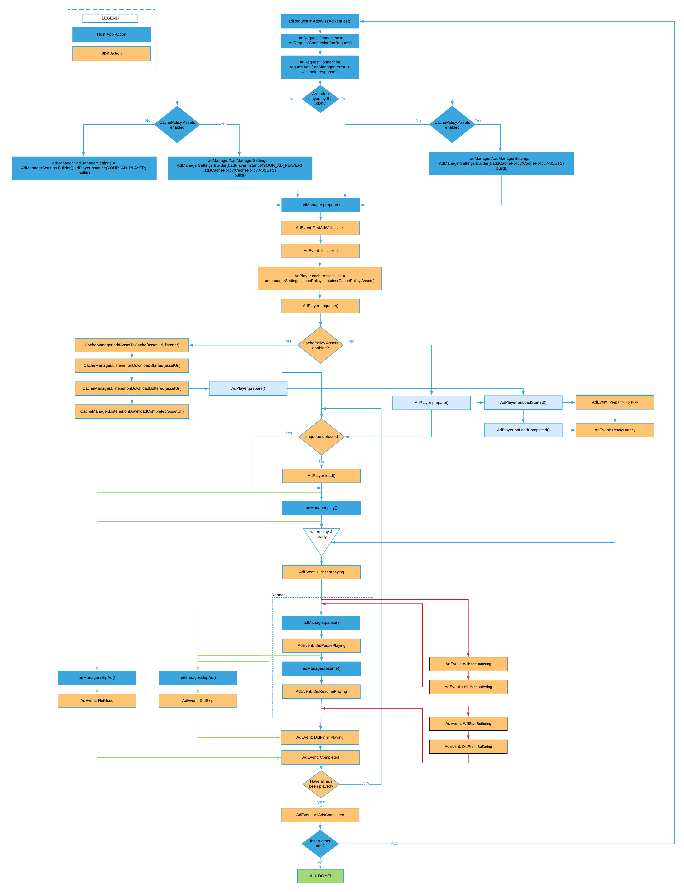

# **AdswizzAdSDK - Integration**
   * [<strong>Get started</strong>](#get-started)
      * [Prerequisites](#prerequisites)
      * [Dependencies](#dependencies)
      * [Permissions](#permissions)
      * [Adding the SDK to your AndroidStudioProject project](#adding-the-sdk-to-your-android-studio-project)
      * [Your first ad request](#your-first-ad-request)
      * [Working with AdManager object](#working-with-admanager-object)
   * [<strong>Companion Banner</strong>](#companion-banner)
      * [Adding an AdCompanionView](#adding-an-adcompanionview)
      * [Setting up](#setting-up)
      * [Companion events](#companion-events)
      * [Extra exposure time for an AdCompanionView](#extra-exposure-time-for-an-adcompanionview)
   * [<strong>Interactive ads</strong>](#interactive-ads)
      * [Handling interactive ad events](#handling-interactive-ad-events)
   * [<strong>Playing ads using your player</strong>](#playing-ads-using-your-player)
      * [AdPlayer Interface](#adplayer-interface)
   * [<strong>AdManager life cycle</strong>](#admanager-life-cycle)
      * [AdManager operations](#admanager-operations)
      * [AdManager Interface](#admanager-interface)
         * [prepare](#prepare)
         * [play](#play)
         * [pause](#pause)
         * [skipAd](#skipad)
         * [reset](#reset)

# Get started

AdswizzAdSDK helps integrating Adswizz interactive ads in your application in a client side scenario. In a client side insertion your app will request ads from Adswizz ad server and you will decide when to play them.

## Prerequisites

* AndroidStudio 3.4+
* Gradle build system

## Dependencies
 A list of external dependencies used in our SDK:
```groovy
kotlinStdlib = "org.jetbrains.kotlin:kotlin-stdlib-jdk7:${kotlin_version}"
kotlinReflect = "org.jetbrains.kotlin:kotlin-reflect:$kotlin_version"
appcompat = "androidx.appcompat:appcompat:${appcompatVersion}"
coreKtx = "androidx.core:core-ktx:${coreKtxVersion}"
firebaseAds = "com.google.firebase:firebase-ads:${firebaseAdsVersion}"
exoPlayer = "com.google.android.exoplayer:exoplayer:$exoPlayerVerison"
gmsPlayServicesAds = "com.google.android.gms:play-services-ads:$gmsPlayServicesAdsVersion"
moshi = "com.squareup.moshi:moshi:$moshiVersion"
moshiAdapters = "com.squareup.moshi:moshi-adapters:$moshiVersion"
moshiCodeGen = "com.squareup.moshi:moshi-kotlin-codegen:$moshiVersion"
androidMaterial = "com.google.android.material:material:$androidMaterialVersion"
constraintLayout = "androidx.constraintlayout:constraintlayout:$constraintLayoutVersion"
lifeCycleExtensions = "androidx.lifecycle:lifecycle-extensions:$lifeCycleExtensionsVersion"
preferenceKtx = "androidx.preference:preference-ktx:$coreKtxVersion"
```

## Permissions

With the addition of the AdswizzAdSDK to your project, there will be some permissions that will appear in your merged manifest file.
You don't need to do anything.

The SDK uses the following permissions, for different interactive ads:

```xml
<manifest>
.....
<uses-permission android:name="android.permission.CALL_PHONE" />
<uses-permission android:name="android.permission.WRITE_EXTERNAL_STORAGE" />
<uses-permission android:name="android.permission.ACCESS_FINE_LOCATION" />
<uses-permission android:name="android.permission.ACCESS_COARSE_LOCATION" />
<uses-permission android:name="android.permission.WRITE_CONTACTS" />
<uses-permission android:name="android.permission.WRITE_CALENDAR" />
<uses-permission android:name="android.permission.CAMERA" />
<uses-permission android:name="android.permission.VIBRATE"/>
......
</manifest>
```
* CALL_PHONE - used for

## Adding the SDK to your Android Studio Project

You can easily integrate AdswizzAdSDK into your project. There are 2 steps to this integration:

1. Inside your project level build.gradle add the following block inside the allprojects->repositories tag:

```groovy
maven {
    url "https://raw.githubusercontent.com/adswizz/ad-sdk-android/master/releases"
        credentials(HttpHeaderCredentials) {
            name = "Authorization"
            value = "Bearer YOUR-AUTH-TOKEN-PROVIDED-BY-ADSWIZZ-PIM"
        }
    authentication {
        header(HttpHeaderAuthentication)
    }
}
```

The final code should look something like this:

```groovy
allprojects {
    repositories {
        google()
        jcenter()
        maven {
            url "https://raw.githubusercontent.com/adswizz/ad-sdk-android/master/releases"
            credentials(HttpHeaderCredentials) {
                name = "Authorization"
                value = "Bearer YOUR-AUTH-TOKEN-PROVIDED-BY-ADSWIZZ-PIM"
            }
            authentication {
                header(HttpHeaderAuthentication)
            }
        }
    }
}
```

2. Inside your module level build.gradle add the following line inside your dependencies block:

```groovy
implementation 'com.adswizz:adswizz-ad-sdk:version'
```

Where <strong>version</strong> is the latest version of the SDK provided by AdsWizz

## Your first ad request

First, you need to add the installationId, provided by an Adswizz engineer, to your manifest. It should look like this:

```xml
<application
    android:name="path.to.myApp.MyApp"
    android:allowBackup="true"
    android:icon="@mipmap/ic_launcher"
    android:label="@string/app_name"
    android:roundIcon="@mipmap/ic_launcher_round"
    android:supportsRtl="true"
    android:theme="@style/AppTheme">
    .......
    <meta-data android:name="com.adswizz.core.installationId" android:value="ADD_YOUR_INSTALLATION_ID_HERE" />
    .......
</application>
```

Second, you need to add the playerId to your manifest. This can have any value that you want. It should look like this:

```xml
<application
    android:name="path.to.myApp.MyApp"
    android:allowBackup="true"
    android:icon="@mipmap/ic_launcher"
    android:label="@string/app_name"
    android:roundIcon="@mipmap/ic_launcher_round"
    android:supportsRtl="true"
    android:theme="@style/AppTheme">
    .......
    <meta-data android:name="com.adswizz.core.installationId" android:value="ADD_YOUR_INSTALLATION_ID_HERE" />
    <meta-data android:name="com.adswizz.core.playerId" android:value="ADD_YOUR_PLAYER_ID_HERE" />
    .......
</application>
```
Next, you need to initialize the AdswizzAdSDK. The recommended way to do this is in the onCreate of your application. If you already extended
the application class just add the following line inside the onCreate method:

```kotlin
AdswizzAdSDK.initialize(this)
```

If you didn't already extend the Application class you can do it now. It should look something like this:

```kotlin
class MyApp : Application() {

    override fun onCreate() {
        super.onCreate()
        AdswizzAdSDK.initialize(this)
    }
}
```

Don't forget to add this new class in your manifest. It should look like this:

```xml
<application
    android:name="path.to.myApp.MyApp"
    android:allowBackup="true"
    android:icon="@mipmap/ic_launcher"
    android:label="@string/app_name"
    android:roundIcon="@mipmap/ic_launcher_round"
    android:supportsRtl="true"
    android:theme="@style/AppTheme">
    .......
</application>
```

You are now ready for your first ad request. You will need to create an AdswizzAdRequest object and configure it.

```kotlin
val adRequest: AdswizzAdRequest = AdswizzAdRequest.Builder() //Build the Ad Request with the needed parameters
            .withServer("SERVER_PROVIDED_BY_PIM")
            .withZoneId("ZONEID_PROVIDED_BY_PIM")
            .withPlayerId("PLAYERID_PROVIDED_BY_PIM")
            .build()
```
Ad server, zoneId and playerId will be provided to you by an Adswizz PIM.

After this point you need create an AdRequestConnection object and call requestAds with the ad request object.

```kotlin            
val adRequestConnection = AdRequestConnection(adRequest) // Create the AdRequestConnection using the above adRequest

adRequestConnection.requestAds { adManager, error ->
            // Handle the response from server
            handleResponse(error, adManager)
        }
```
As a result of this call the SDK will provide you with an error if the call was a failure or an AdManager object if the result was a success.

## Working with AdManager object

If the request to the Adswizz Ad server was a success the SDK will return an AdManager object which you will own and will be the way the SDK will communicate events back to your application. \
To get this communication channel open you need to set up a listener for the AdManager that conforms to the AdManagerListener interface. The AdManager will call:

`onEventReceived(adManager: AdManager, event: AdEvent)` whenever events of interest might happen in the SDK. Consult AdEvent.Type for a list of possible events from the AdswizzAdSDK.

If an error happens in the SDK while using this object `onEventErrorReceived(adManager: AdManager, ad: AdData?, error: Error)` will be called

As a first step, an **_AdManager_** needs to have some settings. You can create an **_AdManagerSettings_** object and pass it to your newly created instance of **_AdManager_**.
In this object you can specify if you want to play the ad with the SDK’s internal player or a player of your choice that must conform to **_AdPlayer_** interface.

Next, you need to call prepare method on the **_AdManager_** object.
This will buffer the ads if you decide the play them with the internal player. Here is how it looks like.

```kotlin
class MainActivity : AppCompatActivity(), AdManagerListener {

    override fun onCreate(savedInstanceState: Bundle?) {
        super.onCreate(savedInstanceState)
        setContentView(R.layout.activity_main)

        val adRequest: AdswizzAdRequest =
            AdswizzAdRequest.Builder() //Build the Ad Request with the needed parameters
                .withServer("SERVER_PROVIDED_BY_PIM")
                .withZoneId("ZONEID_PROVIDED_BY_PIM")
                .withPlayerId("PLAYERID_PROVIDED_BY_PIM")
                .build()

        val adRequestConnection =
            AdRequestConnection(adRequest) // Create the AdRequestConnection using the above adRequest

        adRequestConnection.requestAds { adManager, error ->
            // Handle the response from server
            if (adManager != null) {
                //Handle success
                adManager.adManagerSettings = AdManagerSettings.Builder() // optional
                    .adPlayerInstance(YOUR_AD_PLAYER_GOES_HERE) // optional
                    .build() // optional
                adManager.setListener(this) // Get notifications from the Ad SDK
                adManager.prepare() // Start buffering the ads in the AdManager
            } else {
                //Handle failure
                Log.e("Error", error.toString())
            }
        }
    }

    override fun onEventErrorReceived(adManager: AdManager, ad: AdData?, error: Error) {
    }

    override fun onEventReceived(adManager: AdManager, event: AdEvent) {
        when(event.type) {
            AdEvent.Type.State.DidFinishLoading ->  {
                adManager.play() //Start playing the next ad in the AdManager
            }
            AdEvent.Type.State.DidFinishPlaying -> {
                // Current ad has finished playing
            }
            AdEvent.Type.State.AllAdsDidFinishPlaying -> {
                // All ads from the AdManager have finished
            }

            else  -> {
                //do nothing
                //If you want to handle other events individually you can use the same syntax as above,
                //just specify the event type
            }
        }
    }
}
```
To actually start the **_AdManager_** rolling the ads you must call the play method on the **_AdManager_** as we did in the example above.


# Companion Banner

AdswizzAdSDK lets you configure companion banner(s) if you are provided by the Adswizz PIM with a companion zone id.


## Adding an AdCompanionView

The easiest way to add a companion view is from XML. You could also add the view programmatically.
Once created, the SDK will keep track of all of your companion views and fill them with ad related content as the
ad is playing.
```xml
<?xml version="1.0" encoding="utf-8"?>
<androidx.constraintlayout.widget.ConstraintLayout xmlns:android="http://schemas.android.com/apk/res/android"
        xmlns:app="http://schemas.android.com/apk/res-auto"
        xmlns:tools="http://schemas.android.com/tools"
        android:layout_width="match_parent"
        android:layout_height="match_parent"
        tools:context=".MainActivity">
.....
    <com.ads.coresdk.companion.AdCompanionView
            android:id="@+id/companionView1"
            app:layout_constraintBottom_toBottomOf="parent"
            app:layout_constraintLeft_toLeftOf="parent"
            app:layout_constraintRight_toRightOf="parent"
            app:layout_constraintTop_toTopOf="parent"/>
.......
</androidx.constraintlayout.widget.ConstraintLayout>
```
## Setting up

First when you create an **_AdswizzAdRequest_** you must configure the **_companionZones_** with the value provided by the PIM.

```kotlin
val adRequest = AdswizzAdRequest.Builder() //Build the Ad Request with the needed parameters
                .withServer("SERVER_PROVIDED_BY_PIM")
                .withZoneId("ZONEID_PROVIDED_BY_PIM")
                .withPlayerId("PLAYERID_PROVIDED_BY_PIM")
                .withCompanionZones("COMPANION_PROVIDED_BY_PIM")
                .build()
```

Once the request is made, if there is a companion associated with the ad it will be loaded into your **_AdCompanionView_** object.

## Companion events

You can associate a listener to your AdCompanionView that implements the AdCompanionView.Listener interface.
You will be notified when the ad has loaded the companion view, if the companion view was displayed, or if it ended
the display. If there was an error while loading the companion you will be notified through this listener.
Also, you can decide whether or not to override click through on the companion view.

## Extra exposure time for an AdCompanionView

By default the AdCompanionView will end displaying the content after the ad finishes playing.
If you need to keep the companion on the screen for a longer time(or indefinitely) you can configure it like this.

```kotlin
val adCompanionOptions = AdCompanionOptions()
adCompanionOptions.extraExposureTime = 1.2// these are seconds.
AdswizzAdSDK.setAdCompanionOptions(adCompanionOptions)
```

# Interactive ads

Adswizz interactive ads require some permissions on your app.

TODO -> add permission section

## Handling interactive ad events

While the **_AdManger.Listener_** provides a list of **_AdEventType_** covering the life cycle of an ad it does not provide information on an interactive ad.
To get more insight on what is happening while an interactive ad is playing you can set the **_InteractivityListener_**.
To set the listener, add the following line of code:
```kotlin
AdswizzAdSDK.setInteractivityListener(adManager, interactivityListener)
```

A basic implementation of the **_InteractivityListener_** could looks something like this:

```kotlin
class MyInteractivityListener : InteractivityListener {
    override fun onReceiveInteractivityEvent(
        adManager: AdManager,
        adData: AdData,
        event: InteractivityEvent
    ) {
        when(event) {
            InteractivityEvent.AD_WILL_BE_SKIPPED -> {
                // Ad will be skipped as a result of an action during interactive ad
            }
            InteractivityEvent.SKIP_AD ->  {
                // Ad was skipped as a result of an action during interactive ad
            }
            InteractivityEvent.EXTEND_AD -> {
                // Ad was extended with a new media as a result of an action
            }
        }
    }

    /**
     * Here you can provide your own implementation for coupon presenting
     * @return true if you want to use your own implementation
     * @return false otherwise
     */
    override fun shouldOverrideCouponPresenting(
        adManager: AdManager,
        couponUri: Uri
    ): Boolean {
        TODO()
    }
}
```

# Playing ads using your player

AdswizzAdSDK gives you the possibility to choose whether to play the ad media with your player or let the SDK handle that for you.
By default, the SDK will play the ad. The AdManager object is player agnostic. This means that as long as you provide an
**_AdManagerSettings_** object with an instance of your player before calling ```adManager.prepare()``` the adManager will use your
player to play the ads. Your player must implement the **_AdPlayer_** interface.

## AdPlayer Interface

```kotlin
interface AdPlayer {

    data class MetadataItem(val key: String, val value: String)

    enum class Status {
        // Player state is unknown. Something has happen.
        UNKNOWN,
        // Player is initialized but not playing and does not have an item to play. This should be the default state.
        INITIALIZED,
        // Player is about to begin buffering
        BUFFERING,
        // Player has finished buffering
        BUFFERING_FINISHED,
        // Player is playing the item.
        PLAYING,
        // Player has been paused playing
        PAUSED,
        // Player has finished the whole item. This would be the last state for an item.
        FINISHED,
        // Player failed to load the item
        FAILED,
    }

    fun load(creativeURL: Uri)

    /**
    * Starts the playback of the ad and gives the onPlay/onResume event to the listener
    */
    fun play()

    /**
    * Pauses the playback of the ad and gives the onPause event to the listener
    */
    fun pause()

    /**
    * Resets the player to the initial state
    */
    fun reset()

    /**
     * Reflects the current playback time in seconds for the content.x
     */
    fun getCurrentTime(): Double

    /**
     * Reflects the current track duration from the player
     */
    fun getDuration(): Double?

    /**
     * Reflects the current status for a player.
     */
    fun status(): Status

    /**
    * Used to add a listener to the player's internal state
    */
    fun addListener(listener: Listener)

    fun removeListener(listener: Listener)

    interface Listener {

        fun onBuffering()

        fun onBufferingFinished()

        fun onPlay()

        fun onPause()

        fun onResume()

        fun onEnded()

        fun onError(error: String)

        fun onMetadata(metadataList: List<MetadataItem>)
    }

}
```
Keep in mind that you need to call the right events on the listener so that the adManager knows to take the right actions.

## AdManager operations

Once presented with an AdManager one could call different actions on the AdManager. Let’s break them down.

## AdManager interface
### prepare

You call this method to begin to cycle through the ads in the AdManager. If you decided to let the SDK handle the
playing of the ads this method ensures that the internal player is starting to buffer enough data so that ad playing
starts smoothly. After calling this method the first ad is beginning to load. The SDK will trigger
**_WillStartLoading_** event informing your app that buffering has begun for the ad. If the SDK is
playing the ad you will also get **_DidFinishLoading_** event for the first ad. If you are playing the
ad you will not get this message as your player is responsible to start the buffering process and to also notify
the adManager through the AdPlayer.Listener interface


### play

If you decided to let the SDK play the ads you will need to call **_play_** method on **_DidFinishLoading_**(recommended).
You can call this method after you paused the AdManager to resume playing. AdManager will trigger
a **_DidResumePlaying_** event back to your app for confirmation.


### pause

If you decided to let the SDK play the ads you can call **_pause_** method whenever you need to stop playing the ads
in the AdManager. AdManager will trigger a **_DidPausePlaying_** event back to your app for confirmation.
If you are using your player, please notify the adManager through the AdPlayer.Listener interface.


### skipAd

If you need to skip an ad you can call this method to skip the current ad from the AdManager. Your app will receive
a **_DidFinishPlaying_** event for the current ad and if the AdManager has a new ad you will receive
**_WillStartLoading_** for that one. If no ads are available an **_AllAdsDidFinishPlaying_** will be sent,
signaling that all ads got processed in the AdManager.


### reset

If you decide to skip all ads in the AdManager from the current one you can call this method. For each ad skipped
your app will trigger **_DidFinishPlaying_** and a **_AllAdsDidFinishPlaying_** event will be sent at the end.
Looping through the ad again will need a call to **_prepare_** function.</br>

</br></br>



